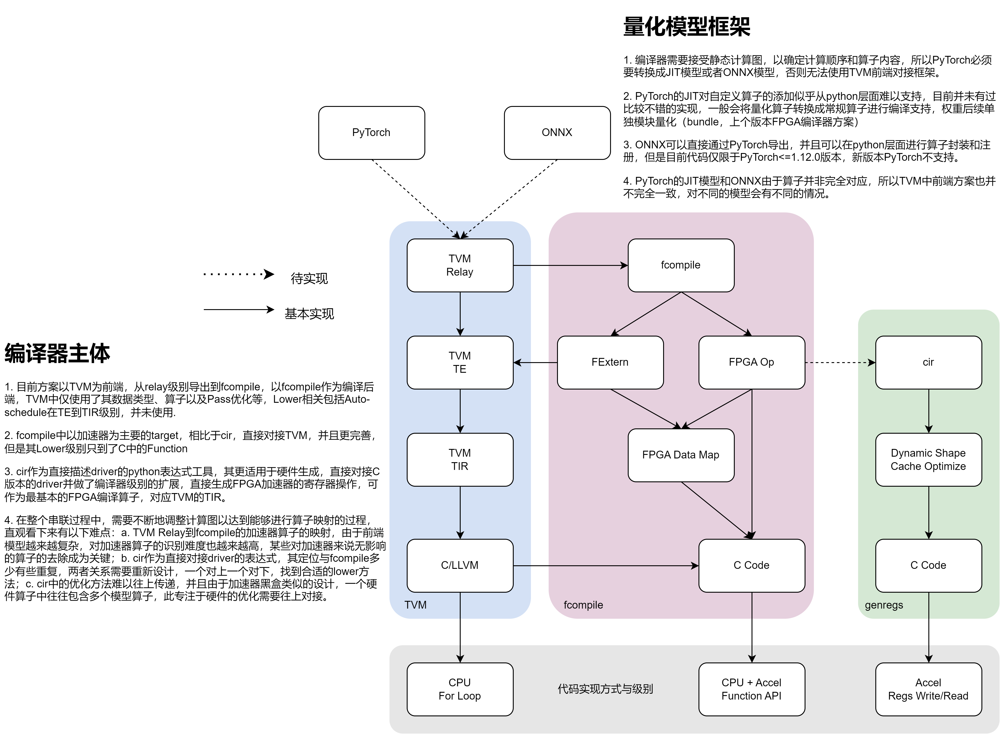

## 2025-2-20

说明：本项目基本已经弃用，其中有关于CIR的介绍即为本项目的前身。除此之外包含了一些开发时的记录，可供参考。

# FPGA-Backend Compile



开发环境:

    tvm, numpy=1.20, modelsim, torch=1.12 for onnx export

编译流程:

    PyTorch(quantized model) --> TVM Relay IR --> Convert Pass --> 
    TVM Relay Accel IR --> FIR --> FPGA / RTL Sim

文件说明:

    fcompile: 软链接，实际地址为tvm/python/fcompile，与TVM共用PYTHONPATH变量
    
    include/rtl/tb: RTL源码和Testbench等
    
    python: main函数脚本，主要测试与控制目录
    
    sim: RTL仿真目录
    
    template: FPGA部署例子，其中包括加速器驱动等等
    
    tvm: fpga-accel版本的tvm源码

本项目以FPGA Accel为编译Target，整体数据类型以MAX_DATA_WIDTH流通（8bit，其涉及到malloc时的空间大小），CPU算子（TVM算子）均被视为Extern算子，以函数调用的形式提供。

|   Op Name   |  Relay Op  | ModelSIM | FPGA JIT |
|:-----------:|:----------:|:--------:|:--------:|
|   conv_mp   |   conv2d   | &#10004; | &#10004; |
|     MVM     |     mm     | &#10004; | &#10004; |
|   softmax   |   softmax  | &#10004; | &#10004; |
|  TRANSPOSE  |  transpose | &#10004; | &#10004; |
|     LN      | layer_norm | &#10004; | &#10006; |
| mp_conv_res | conv2d_add | &#10004; | &#10006; |

> Op Name为testbench名称，存在testbench_前缀；Relay Op为tvm注册的加速器算子名，存在relay.accel.vit.前缀

## 新算子注册添加

fcompile为FPGA加速器深度学习编译器后端，前端依赖TVM及其数据类型和优化方法。在新算子注册的流程中，需要同时在TVM和fcompile中注册相应的算子。

1. 根据需要在tvm/include/relay/attrs.h中添加attrs类型，目前已经在使用的类型为AccelOpAttrs，其以卷积为基础添加了精度信息。

2. 在tvm/src/relay/op/accel/**.cc中编写算子注册，主要包括Make函数，Rel函数（InferType）以及算子注册。

3. 在tvm/python/relay/op/accel/**.py中编写make函数，为python调用算子的入口。

4. 在fcompile/op/op_fpga.py中添加对tvm中新注册的算子的映射，并根据实际编写对应的fpga_jit和modelsim函数。

5. 如果需要modelsim仿真，对应的testbench需要做一定修改，如下：

    5.1. 添加`timescale设置，由于modelsim仿真器的设定，需要在top module中设置timescale而不是其他地方。

    5.2. 根据输入输出定义相同数目个二维bit数组，bit宽度为MAX_DAT_WIDTH。

    5.3. 利用上述bit数组，修改dat_in，wt_in函数的输入，并将dat_out保存。

    5.4. 在initial begin中添加对应的readmemh函数和writememh函数，其名称应与python中modelsim函数中文件名称相同。

6. 算子注册完成后，可以参考python/check.py编写对应的check函数，以进行检查。

当前，由于没有Tuple的存在，没有多输出函数。并且TVM扩展算子中，理论上只支持没有权重导入、单输入单输出的算子。

算子注册完成后会在python/check.py中进行pytorch与RTL行为仿真的联合验证。

## TVM Relay Accel IR --> FIR --> RTL Sim

本项目开发环境为WSL+Windows(ModelSIM)，如果为Linux系统则需要添加ModelSIM环境变量并修改sim/bin/Makefile的Tools，目前Windows系统由于路径问题暂不支持，其他仿真器暂无支持。

具体参考函数如下：

```python
# python/main.py
main_accel_modelsim()

# python/main.py
main_accel_extern_modelsim()
```

0. 仿真准备

    首先需要将rtl文件进行编译，tb文件在仿真时编译

```shell
cd sim
make install
make compile
```

1. 搭建计算图

    当前暂无Relay Convert Relay Accel的Pass方法，所以直接通过Relay Accel IR搭建计算图，并生成IRModule。其中，InferType优化方法是必须的。

2. FIR转换

    将tvm的relay计算结构转换为fcompile中提供的fir计算结构。此计算结构可以直接打印查看结果。

3. 仿真执行

    在仿真阶段，FIR计算结构不需要进行优化，数据以numpy.array类型流通。在新的环境下，fcompile.config.SIM_ROOT需要根据sim文件夹的路径进行更改。

## TVM Relay Accel IR --> FIR --> FPGA

FPGA代码的生成不需要特殊环境。由于FPGA代码涉及C语言，其开发较为精细，所以后续需要根据实际情况调整达到更好的效果。

具体参考函数如下：

```python
# python/main.py
main_accel_ccodegen()

# python/main.py
main_accel_extern_ccodegen()
```

### FPGA Jit

首先需要将FIR进行优化，主要包括权重加载和离线处理，数据Map以及运行时不同数据类型的转换。 其次，将模型静态化导出也是需要的。其导出的格式为python中的dict数据类型，其概括与说明如下：

```python
[
    {
        "node_type" : "call", # var, const, call, extern, output
        "static" : {
            "name" : name,
            "type" : OpType.xxx,
            "attrs" : [xxx]
        }, # static global variable
        "callop" : [
            op1,
            op2,
        ], # string op function list in run module
        "params" : [
            op1,
            op2,
        ], # op function in param module
        "return" : {
            "name" : name,
            "type" : OpType.xxx,
            "shape" : shape,
            "free" : free
        } # used as arg for the next operator
          # most of the time not used in codegen
    }
]
```

后续的代码或模型的生成均依赖此结构。

### Target C Code Generator

C语言版本的代码生成器，即将Accel算子和整体计算图全部转换为C语言模型文件，并依赖同时生成的权重bin文件和扩展算子对应的C语言文件。后续编写对应的main.c文件即可。

此FPGA部署代码在template中。

## Development

__2023.10.12__

1. 在tvm/src中注册算子，先添加相应的attrs在include中，然后在src/relay/op中添加make方法，注册算子

2. 在tvm/python中添加对应算子的make函数和attrs的数据类型注册

3. 开发后端编译器的AST，命名为FIR，其中包含FVar，FCVar，FCall，FExtern，FModule等类型，FTuple暂未支持

4. 对于FIR开发遍历方法，可以通过继承Funtor或Mutator并重载相应的visit函数实现

5. 在后端编译器中添加对应的算子，主要包含仿真函数和fpga_jit静态化函数

6. 开发相应的优化方法，使得计算图更连续，可生成更直接的jit_mod

7. 开发CodeGen对象，目前主要开发了C语言对象方法

__2023.10.14__

1. 对于modelsim的仿真，需要先建立sim仿真项目，由Makefile编写控制，然后由python控制Makefile完成

2. 数据的输入以memh进行，在testbench中使用readmemh读取数据，writememh写出结果

3. extern算子中直接通过调用TVM Graph Execution计算完成

## TODO List

1. 添加scale量化计算相关算子，或以Map和DeMap函数为基础做扩展。

2. 考虑FeatureDDR到WeightDDR数据类型的转变，在lib库中添加或作为扩展算子实现。

3. Extern算子进行融合和优化，Extern JIT能够正确生成多算子的计算图。

4. FTuple类型的支持，对多输出算子的支持

5. 加速器相关的两种优化：第一层卷积的特定优化（channels较低）；使用片上数据连续计算

6. 尝试从NHWST数据layout进行计算，更贴近加速器数据类型，尽可能减少运行时layout转换

7. 数据类型的多样性，提供以uint16和fp32为基础的数据类型的编译处理。

## Dynamic Shape Compile

__2023.11.23__

动态shape的编译相比静态shape的编译，会不可避免地存在runtime延迟，主要原因有两个：1. 具体参数无法在编译器中全部计算，某些参数需要根据shape来确定；2. 某些专注于静态编译中的优化方法在动态编译中不再适用。因此，动态编译的方案只能无限趋近静态优化编译方案，即以静态编译为基础，尽可能地将动态编译化为更简。

由于dynamic shape中引入了变量，即类似(1, x, 3)的形式，所以常规计算存在str和int之间的问题，此问题是动态编译的核心问题。解决此问题的方法是通过类似表达式的方式，能够智能的将变量和数字、数字和数字、变量和变量组合成表达式，并且根据表达式生成对应的公式或者结果。

借鉴tvm中的te模块(tensor expression)，设计了一个新ne(number expression)的包，一个基类Expr，两个子类Var和Numb，以区分变量（不可计算）和数字（可计算）。表达式以树的数据结构存储，一个Expr包括一个计算方法（Op），一个Expr数据类型的list作为输入，以深度优先搜索的方式进行遍历，若一个Expr中的list全部都为Numb，则此Expr可以直接计算并且转化为新的Numb。

在整体编译过程中，动态编译与静态编译过程相同，并且基本实现了对原代码的复用，但是由于变量的存在，if和for两种代码模块实际上无法复用源代码，所以if依然作为一种特殊的Expr实现，其输出为三目计算式，而for进行了重新封装，若上下限均可计算，则进入for循环代码进行，若上下限存在变量，则代入变量进行一次for循环代码，并以hook的形式生成for对应的编译代码，代表此for循环依赖动态shape，无法在编译器中推理。

目前，为了尽可能减少runtime的工作，在变量中引入了最大值的机制以计算数据的基地址，尽可能地保证数据的地址不发生改变（依然可以生成为表达式的形式，需要重构对应的codegen代码）

其次，由于ne方法主要是尽可能地将变量和数字比较丝滑的连接在一起，简化为对应的表达式或者对应的结果，其主要功能基本实现，但是对于表达式的简化情况比较一般，尽管存在进一步简化的可能，但是目前不再考虑，c编译器对此应该会有较为不错的优化。

作为隐患，表达式的结果与真正的c语言的结果是否对应的上，需要验证，目前此工作暂未进行。

## FCompile and CIR

__2023.12.14__

在编译器的开发过程中，fcompile首先被设计出来，最初作用于加速器算子权重的预处理和runtime代码的生成，即v1版本中tvm.extern+bundle的代替。相比原本的tvm.extern方法，此模块更聚焦加速器数据，以加速器为主要target，cpu算子为external target。尽管tvm能够实现更好的静态内存的最小化分配，但是目前来看此优势并非是不可或缺的。fcompile至上连接tvm accel relay，至下达到driver lib API。

cir原本是为了将加速器驱动代码从c转移至python表达式而开发，其设计更贴近底层并且能够直接控制加速器的寄存器，相比fcompile实为巨大提升。cir本身开发并不严谨，尽管具有编译器应有的AST，但直接作为完整的编译器还是有些困难。由于其可以看作为加速器驱动在python上的编译器映射，所以在对更加偏向底层的优化非常有利。cir至上仅能达到某些特别的算子表达式，至下却可以达到加速器寄存器。

fcompile和cir的定位，在某种程度上来说多少有些冲突，两者中任何一个作为核心IR都能完整实现编译器的功能。不过目前看来，将fcompile看作tvm relay级别，cir看作tvm tir级别或许也是合适的。在此定义上，fcompile主要与模型对接，cir主要与加速器对接，在fcompile的算子中定义cir的实现方式，以lower连接两者。fcompile应与tvm中的relay算子类似，具有schedule和compute分离的特点，但是目前，schedule缺失，需要添加，算子输出shape完全静态固定；compute的定义也不完善，方案待优化。

至此，fcompile可以尽可能与模型一致，定位在计算图级别，进行数据的控制映射以及算子间的调度；cir应完全与加速器驱动一致，定位在算子界别，以开放完整的加速器接口为目标，进行算子层面的优化。
