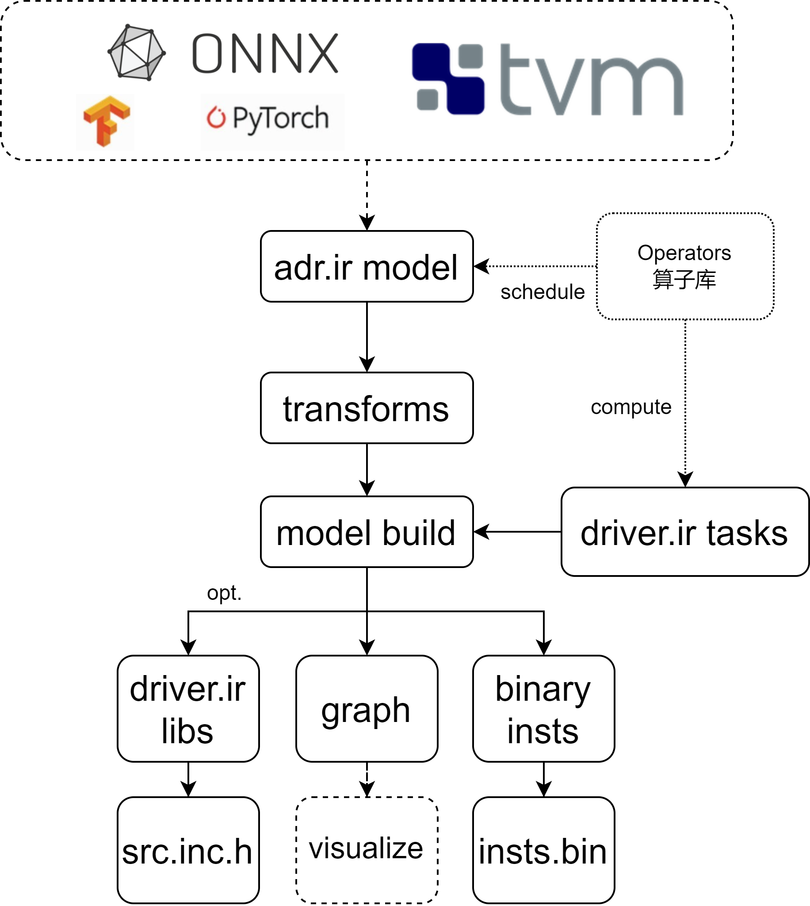

# DeepLearning Accelerator Virtual Machine

本项目参照TVM，重新设计编译流程，以加速器为主要的后端Target进行构建，最终预想为以ONNX模型为输入（或其他级别IR）以不同深度学习加速器为输出（Target）的端到端深度学习编译系统。

项目文件结构：

    adr: 编译器基础的数据结构的定义以及算子注册相关，包含算子schedule和make函数
    
    backend: 编译器的后端部分，基于driver.IR实现，主要包括算子编译以及代码生成部分，对应多种编译逻辑，包括Regs和Aux
    
    clib: 在常规处理中需要用到的C语言库的接口，也包含部分数据处理函数
    
    codegen: 编译器的后端部分，后续不再维护，以直接代码生成方式进行后端实现，方式较为死板且固定
    
    device: 添加不同后端加速器的配置设定，能够进行device的选择，对应加速器的宏定义
    
    driver: 算子compute相关，即tasks函数，算子对应的寄存器配置生成，除此之外包含底层ir的实现，以中间代码实现tasks
    
    frontend: 编译器的前端部分，当前只包含对ONNX框架的支持，后续添加对其他框架或IR（如TVM）的支持
    
    llm: 已经release的大模型计算图代码，以adr.ir实现，直接可接入
    
    ne: Number Expression数字表达式，为编译器提供动态控制的核心
    
    runtime: 考虑作为编译后模型运行的组件，目前未开发完成
    
    target: 对应backend和driver.IR，为其实际的代码生成模块，对每一个表达式(Expression/Expr)和语句(Statement/Stmt)进行了代码实现
    
    transform: 编译阶段计算图转换部分，通常涉及计算图形状推理、优化或者权重离线处理等
    
    utils: 一些简单的组件，如log、cout等


+ 本文以开发者视角，主要描述如何使用和开发此项目

## 使用编译器进行模型编译

+ 此项目可以参考script/main.py做具体参考

对于一个模型的部署，实际需要的为三个内容/文件：权重、算子和计算图(计算流程)。考虑此项目由于开发时没有权重处理的需求，所以仅预留了权重预处理相关的位置但实际不做处理；计算图需由模型提供，所以需要作为编译器的输入；而算子已经在编译器中注册完成，可以直接调用。所以，需要用编译器中提供的封装好的算子去将计算图表示出来（此过程目前需要手动编写，后续提供直接模型加载方法，如onnx），实际操作与tensorflow类似：

1. 模型计算图的编写和定义

```python
from dlavm import ne
from dlavm import adr

token = ne.Var("token", max_data=2048) # 动态维度定义，2048指此值最大为2048，以方便空间地址计算
a = adr.hbm.var_ddr(name="a", shape=(1, token, 4096)) # 定义一个ddr的变量，也即input，名字为a，形状为(1, token, 4096)
b = adr.hbm.const_hbm(name="b", data="hbm_weight.bin", shape=(4096, 256)) # 定义一个hbm类型的权重，名字叫b，shape方向为(CHin, CHout)
c = adr.hbm.mvm(a, b) # 定义一个矩阵乘法运算，结果为c
```

以上，完成了一个MVM算子的定义。实际有哪些算子可用，可以参考dlavm.llm的定义方式进行学习，或直接找到dlavm/adr/op/hbm.py中参考并调用。需要强调的是，由于多个版本的兼容问题，有些算子实际上已经放弃维护，需要注意。在编写过程中，可以随时打印对应的中间结果（如上的c）进行显示:

```shell
def main(a) {
  a = var()
  b = constant()
  %0 = accel.hbm.mvm(a, b)
  return %0
}
```

+ 注意，如果算子层数过多，那么会出现python的error，大体情况为递归超过上限，则需要在代码前加入以下设置：

```python
import sys
sys.setrecursionlimit(3000) # 默认为1000，也可根据电脑和模型情况设置更高
```

2. 计算图优化和处理

计算图编写完成后，需要做验证和(形状)推理，既判断此计算图编写是否合理，是否能继续后续的编译，如类型是否合规(MVM的第二个参数需要为HBM，int4类型)，形状是否合规(矩阵乘法：(1, token, chin_0)x(chin_1, chout)，需判断chin_0是否与chin_1相等)。如果检查通过，则会进行此节点的形状推理，推理出此节点的输出维度：

```python
from dlavm import device
from dlavm import transform

last_token = ne.Var("last_token", max_data=2048) # 定义last_token，统一加载到所有计算图的节点中
# 第一个参数为上述定义好的计算图，第二个参数为此编译需要的硬件加速器配置，也即宏定义，第三个参数为全局属性，会加载到所有算子节点上去
c = transform.infer_type(c, device.hbm_accel.HBM0923, attrs={"last_token": last_token}) # c为通过优化后的计算图
```

c计算图依然可以打印进行展示，如下，此时可以发现，每个节点的内容均已打印出来，ret为return，即为当前节点的尺寸

```shell
def main(a) {
  a = var() /* ret=(1, token, 4096), dtype=(float16, ddr), device=hbm */
  b = constant() /* ret=(4096, 256), dtype=(int4, hbm), device=hbm */
  %0 = accel.hbm.mvm(a, b) /* ret=(1, token, 256), dtype=(float16, ddr), device=hbm */
  return %0
}
```

+ 以上infer_type是必须的优化，由于手动编写计算图考虑已经为最优情况，所以其他优化方法如算子融合、死算子消除等已经没有使用的必要，完善好onnx等前端后可以考虑使用。数据离线处理实用性较强，可在此阶段完善。

3. 优化设置与编译

接下来需要对编译进行设置，主要包括地址相关、内存相关、代码生成相关等。

- 内存块前缀与基地址设置

  内存块必须包括："global", "weight", "runtime", "insts", "hbm", "hbm_cache"，可能需包括："cache", "onchip"
  
  runtime, onchip类型，均具有pingpong性质，会根据使用的情况，自动覆盖数据，如果需要新添加类似的内存块，考虑在dlavm/backend/plan_memory.py中找到pingpong=[]，添加新的内存前缀即可。其余内存块均无pingpong属性，其主要包括权重数据、指令数据，cache数据等。

  内存块整体的排布通过python的dict实现：如{"global": 0x0, "weight": "global", "hbm": 0x0, "hbm_cache": "hbm"}，此内存块的排布方案为：global的基地址为0x0，weight的地址排布在global后，hbm在新的0x0地址上，hbm_cache排布在hbm后，也即key值为内存块，value值为key值对应的地址情况（新的基地址或上一个内存块的名字）

- 编译相关设置

  以下介绍主要的设置信息，其信息均需用dict字典保存：

    wt2hbm: Bool值，默认为False，是否开启wt2hbm权重加载，否则为pcie2hbm

    debug: Bool值，默认为True，实际为log记录算子的地址转移情况

    ddr_base/hbm_base: Int值，为ddr和hbm的基地址信息，VCU128为0x2_0000_0000/0x0

    align: Int值，默认为0x10，为内存对齐情况，即在每次malloc时的最小内存单元

    lite: Bool值，默认为False，如果开启，则会强制将for循环去掉，避免由于for循环对kvcache的负优化

    namespace: Bool值，默认为False，如果开启，会对target为C++的h文件生成具有namespace的代码，以同时使用多个模型进行加载

- 其余设置

  其余主要包括name，函数/模型名，编译模式(Regs模式和Aux模式)，以及代码生成对象

实际代码编写如下：

```python
from dlavm import backend
from dlavm.target import targets

target = targets.hpp # 目前仅支持hpp
init_addr = {"global": 0x0, "weight": "global", "runtime": "weight", "insts": "runtime", "hbm": 0x0, "hbm_cache": "hbm"}
build_config = {"wt2hbm": True, "debug": True, "ddr_base": 0x20000_0000, "hbm_base": 0x0, "align": 0x4000}
# 参数分别为：计算图，地址块，模型名，是否aux，代码target生成，编译设置
mod = backend.build(c, init_addr, "model_mvm", True, target, build_config) # 实际编译
```

4. 编译目标生成与保存

上述生成的mod即为最终的编译目标，根据需要可以进行进一步的工作，主要包括：代码生成、指令生成(aux模式)等，后续考虑更新直接运行、可视化算子计算图等等。

以当前功能为例：

```python
source = mod.get_source()
insts = mod.get_insts_bin()

with open("src.inc.h", "w") as f:
    f.write(source)

with open("inst.bin", "wb") as f:
    f.write(insts)
```

5. 编译生成的头文件简介

首先，需注意，此项目生成的.h头文件并非常规的头文件，此文件更类似于”一次性“的.inc类型头文件，内容为C++代码片段，但是以头文件形式引用，由于声明和定义包含在一起，所以只能被加载一次。

此文件整体结构内容如下：

```cpp
// generated by dlavm.backend in 2024-10-26 19:47:13

// runtime storage define
uint64_t runtime0 = 0x000000000;
...
// hbm storage define
uint64_t hbm0 = 0x000000000;

uint64_t a = (runtime0 + 8589934592);

uint64_t output = (runtime1 + 8589934592);

...

void model_mvm_load_params(HANDLE& device, HANDLE& h2cx, char* prefix) {
  b_load_param(device, h2cx, prefix);
}

...

void model_mvm(HANDLE& device) {
  aux_block_1(device);
}
```

其中，runtime0、hbm0等即为内存块，a、output为输入、输出的实际地址（或输出函数封装），而xxxx_load_params和xxxx即为封装好的权重加载和模型运行函数。


## 编译器开发细节指南

由于编译器比较庞大，所以修改起来并非易事，以下展示了一些特定方向的更新维护和开发。

首先需要介绍整体编译器的结构和开发原理，编译器中定义了两层的IR（中间代码），第一层以对接模型前端，称其为adr.ir，如ONNX、TVM等框架，进行模型转换，将现有的框架算子读入编译器中并以此编译器给定的算子（或称其为IR）进行统一；第二层IR实现了每个算子的计算（对于加速器来说实际上为寄存器指令的生成），称其为driver.ir，这样可以更方便扩展后端代码的生成；具体情况如下：



### 新算子注册/更新

编译器采用算子注册机制（仿照TVM），如果需要新的算子时需先注册，才能使用。如上图，算子库中主要将算子的调度和计算进行了分开，算子调度可以认为是算子串联情况，如形状推理、类型推理等，计算在此处主要指寄存器指令的生成。接下来，以MVM算子为例，对算子的注册过程进行描述：

1. 注册算子，实现算子调度

MVM算子的注册，我们假设它属于hbm算子库中。根据上图，我们主要需要在adr.ir中提供此算子以及其调度方法：在adr/op文件夹下新建_hbm.py和hbm.py两个文件（已建立），并添加进对应的__init__.py中。

首先应在_hbm.py中对算子的调度/推理进行定义和注册，其中，MVMRel的参数是固定的，args为此算子的输入，attrs为此算子的属性。定义完成调度/推理函数MVMRel过后，将此函数指针与算子名一起进行注册，直接调用Op.Register即可

```python
# _hbm.py
from ..base import Op, Tensor, Tuple, DataEnum, DataType

def MVMRel(args, attrs):
    if len(args) != attrs["skip"]+1:
        return False, "skip should be 1"
    device = args[0].device
    dshape, dtype = args[0].shape, args[0].dtype  # H, W, C
    wshape, wtype = args[1].shape, args[1].dtype  # Cin, Cout
    if dtype.mapped != DataEnum.ddr or dtype.dtype != DataEnum.fp16:
        return False, "data type error, should be ddr with fp16"
    if wtype.mapped != DataEnum.hbm or wtype.dtype != DataEnum.int4:
        return False, "weight type error, should be ddr with int4"
    if dshape[-1] != wshape[0]:
        return False, "weight shape should be [in_channels, out_channels]"
    if len(args) > 2:
        for n in range(len(args)-2):
            if args[1] != args[2+n]:
                return False, "not support"
    if attrs.get("arg_max", 0):
        return False, "arg max not support now"
    oshape = [i for i in dshape]
    oshape[-1] = wshape[-1]
    return True, Tensor(oshape, dtype, device)

Op.Register("accel.hbm.mvm", MVMRel)
```

由此，算子库中已存在此名为"accel.hbm.mvm"算子，调度方式为MVMRel函数。

2. 封装算子的调用

虽然我们已注册成功名为"accel.hbm.mvm"算子，但是我们并未提供一种对于使用者来说较为简单的算子调用方法。此方法我们考虑将其定义在hbm.py文件中，具体如下：

```python
from ..base import Op, Call, Var, Constant, DataEnum, DataType

def mvm(data, weight, skip=1, **kwattrs):
    attrs = {
        "skip": skip,
        **kwattrs
    }
    return Call(Op.Get("accel.hbm.mvm"), [data, weight], attrs)
```

此函数的参数很灵活，根据需要自行调整，将需要作为算子属性的参数添加入函数输入即可，如Conv2D的strides和padding，即可添加进attrs中。其次，return Call(op, args, attrs)函数较为固定，data、weight为此算子的输入，也即args，由list记录，返回算子调用节点（adr.ir Call节点）。

+ 对与Var（Input）和Constant（Weight）节点，请参考dlavm/adr/op/hbm.py的var_ddr，const_ddr，const_hbm等函数

3. 算子测试（选）

算子注册完成后可参照 __编译器的使用方法__ 中提到的编写计算图的过程，对算子的注册和调度情况进行测试。其中使用此算子的方式即为调用2中定义的函数。

4. 算子计算的注册/硬件tasks的更新

定义完算子的调度方法后，需要完成对算子的计算方法的定义和注册。通常这部分代码会存储在dlavm/driver中，上述注册的算子名为"accel.hbm.mvm"，为了更好的区分每个算子所属的类别，那么此算子的计算/tasks函数可以保存在hbm_ir中。需注意，此处的ir与上述的ir逻辑不同，此处的ir指的是driver.ir，是为了定义算子的计算方法，更符合C/C++的中间代码（既存在表达式expr又存在语句stmt）；而上述的ir指的是adr.ir，更符合深度学习的中间代码（仅包含表达式而无语句）。

以下依然以"accel.hbm.mvm"为例，简述算子计算的注册。首先，在dlavm/driver/hbm_ir中新建__init__.py，\_hbm_compute.py和tasks.py，其中__init__.py主要为加载注册函数，防止在调用算子前没有加载注册好的内容，具体可以参考dlavm/driver/hbm_ir/\_\_init\_\_.py的内容；tasks.py为硬件testbench翻译而来的最小化的驱动函数；\_hbm_compute.py即为__init__.py需要加载的注册对象，并连接编译器与tasks.py的内容：

```python
# tasks.py
import math
import numpy as np
from dlavm import ne
from ...clib import FP32_to_FP20
from ...device import hbm_accel
from ..basic import Tasks
from .. import ir
from ..ir import CSB_Write, CSB_Read, While

@Tasks.Register("atom.hbm.mvm", hbm_accel.HBM0912)
def MVMBasic(block, args, outputs, device, onchip={}, kvcache=0, EW_MODE=0, **attrs):
    dshape = args[0].shape
    daddrs = args[0].get_address()
    ...
    block += CSB_Write(2,0)
    ...
    block += CSB_Write(33,mode)
    block += While(CSB_Read(1) != 1)
```

如果硬件驱动需要更新，建议新建一个device版本，并进行参数更新，如现在dlavm/device/hbm_accel.py中创建新的device：

```python
# dlavm/device/hbm_accel.py
class HBM0923(HBM0912):
    version = 20240923

# dlavm/driver/hbm_ir/tasks.py
@Tasks.Register("atom.hbm.mvm", hbm_accel.HBM0923)
def NewMVMBasic(...):
```

需要强调的是，@Tasks.Register为注册方法，第一个参数为tasks注册的名字，第二个参数为加速器的设备版本，以方便多版本管理和同步。在调用时会自动找到对应的tasks最新的实现方法。其次，需要解释MVMBasic函数的一些参数含义：通常来说，此函数的参数无需完全固定，但是block(driver.ir，用于记录需要进行代码生成的操作)、args(输入的list，每个元素都具有shape、get_address()属性)、outputs以及device等参数较为关键，需要谨慎考虑；为了更容易扩展，建议保留**attrs的位置。

此处，我们注册的一个tasks，参考名字，此tasks为原子操作，即不含有for循环/多次计算等操作，实际的计算拆分需要通过driver.ir实现并使用for循环（driver.ir中定义的）去连续调用tasks来实现。以下为简单的描述，具体可参考dlavm/driver/hbm_ir/_hbm_compute.py

```python
def MVM(args, outputs, **attrs):
    device = args[0].device
    Hin, Win = 1, args[0].shape[-2]
    CHin, CHout = args[1].shape
    PixelBytes, Tin = device.Pixel_Data_Bytes, device.base_Tin
    DAT_BRAM_DEPTH = device.DAT_BRAM_DEPTH
    strides = [Hin*Win*PixelBytes, Win*PixelBytes, PixelBytes]
    if hasattr(args[0], "strides"):
        strides = args[0].strides
    WT_CHin_div_Tin = Ceil(CHin, Tin)
    if DAT_BRAM_DEPTH < WT_CHin_div_Tin:
        raise RuntimeError("Could not split now for MVM")
    w_slice = DAT_BRAM_DEPTH // WT_CHin_div_Tin
    with ir.Function(get_vars([args[0].shape, attrs])) as func:
        out_w_slice            = w_slice
        min_dat_depth          = Win*WT_CHin_div_Tin
        Wout_Split_Times_minus1= (min_dat_depth+(out_w_slice*WT_CHin_div_Tin)-1)//(out_w_slice*WT_CHin_div_Tin) -1
        Wout_Split_Times_minus1= func.assign("wout_split_times_minus1", Wout_Split_Times_minus1, "int")
        Wout_Split_Times       = Wout_Split_Times_minus1 + 1
        out_w_slice_last       = (min_dat_depth-(Wout_Split_Times_minus1)*out_w_slice*WT_CHin_div_Tin)//WT_CHin_div_Tin
        out_w_slice_last       = func.assign("out_w_slice_last", out_w_slice_last, "int")
        with ir.For("out_w", 0, Wout_Split_Times) as w:
            w_slice = ne.If(w.var < Wout_Split_Times_minus1, out_w_slice, out_w_slice_last)
            dshape = replace(args[0].shape, -2, w_slice)
            data = args[0].gen_tensor(shape=dshape, offset=w.var*out_w_slice*PixelBytes+args[0].offset)
            setattr(data, "strides", strides)
            oshape = replace(outputs[0].shape, -2, w_slice)
            output = Tensor(oshape, outputs[0].dtype, device)
            output = outputs[0].gen_tensor(shape=oshape, offset=w.var*out_w_slice*PixelBytes+outputs[0].offset)
            setattr(output, "strides", strides)
            Tasks.Get("atom.hbm.mvm", device)(w, replace(args, 0, data), replace(outputs, 0, output), device, **attrs)
        func += w
    return func

Op.Get("accel.hbm.mvm").attrs["compute"] = MVM
```

上述中的ir.Function为必须，意为创建一个函数的ir，其本身就可作为上述驱动tasks的block进行输入，或者类似此驱动，将ir.For作为Block进行输入，实际将tasks嵌入了funtion和for循环中。此处的实现描述较少，建议多仿照dlavm/driver/hbm_ir/_hbm_compute.py中的内容进行编写和补充。

5. AUX模式中参数定义（选）

为了支持AUX，需要每个算子提供AUX相关的设置内容。此内容实际较为简单，主要为instruction和位宽倍数：

```python
Op.Get("accel.hbm.mvm").attrs["cfg_id"] = [0b00001000, 2] # 2*AXI_DAT_WIDTH
```

以此，算子注册任务完成。

### 新Target代码生成后端的注册

为了支持更多的运行平台和目标，需要支持更多的编译后端，如VCU128的FPGA为Windows平台，而V80却为Linux平台，并且其某些驱动和函数的API存在不同。所以，我们将target编译目标作为后端，通过对上述driver.ir进行指定target的解析，即可完成代码的生成任务。目前代码的生成主要支持的是hpp，即C++的头文件。接下来将以此为基础做一些简单的修改和描述。

1. 新建target目标

为了标准化，我们考虑不将target作为字符串输入。所有的target对象保存在dlavm/target中。首先，新建字符串为target对象在targets.py中：

```python
v80 = "v80"
```

2. 新建对应的CodeGen方法

在dlavm/target中新建codegen_v80.py文件。为了简单起见，我们考虑v80的驱动代码和hpp的驱动代码相差不多，主要是没有了HANDLE相关内容。

```python
from dlavm.driver import ir, transform
from . import targets
from .codegen_base import CodeGenEngine
from .codegen_h import CodeGenH


@CodeGenEngine.Register(targets.v80)
class CodeGenV80(CodeGenH):

    def main(self, stmt: ir.Function):
        stmt = transform.InferArgs(handle=False).Visit(stmt)
        self._memo_lib = []
        source = self.Visit(stmt)
        return source

    def VisitCSBWrite(self, stmt: ir.CSB_Write):
        tabs = self.tab * self.tab_num
        addr = self.Visit(stmt.addr)
        data = self.Visit(stmt.data)
        return tabs + f"CSB_Write({addr}, {data});"

    def VisitCSBRead(self, expr: ir.CSB_Read):
        addr = self.Visit(expr.addr)
        return f"CSB_Read({addr})"

    ...
```

由于整体平台的API相差不大，所以直接继承CodeGenH来进行改写。main函数为整个代码生成的入口，所以必须有。其次，transform.InferArgs为优化方法，主要优化了ir的函数传入的参数，去除无用参数，并且如果需要添加HANDLE的话直接添加进ir的函数参数中。

其次，对于特殊的节点，进行了改写，如CSB_Write节点，去除device的生成，CSB_Read节点同理。具体都有哪些节点可以改写，可以参考dlavm/target/codegen_h.py。

至此，此代码生成后端V80即可调用。使用方法为:

```python
from dlavm.target import targets

target = targets.v80
```
